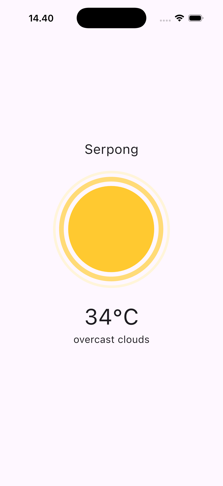

# 🌤 Weather App Flutter
A clean and modern Weather App built with Flutter, showing real-time weather info with smooth Lottie animations.  

## Features
- Get weather by city name or current location
- Fallback to coordinates if city search fails
- Beautiful Lottie animations for different weather conditions
- Responsive and user-friendly UI

## Tech Stack
- Flutter & Dart  
- Lottie for animations  
- OpenWeatherMap API (or any weather API)

## 📱 App Preview
Here’s how the app looks:

  
  

## How to Run

### 1. Clone the repo
<pre><code>git clone https://github.com/faldi17/weatherapp-flutter.git</code></pre>

### 2. Go to the project folder
<pre><code>cd weatherapp-flutter</code></pre>

### 3. Install dependencies
<pre><code>flutter pub get</code></pre>

### 4. Run the app
<pre><code>flutter run</code></pre>

## Notes
- Make sure location permission is enabled on your device.
- Add your API key in `weather_service.dart`.
